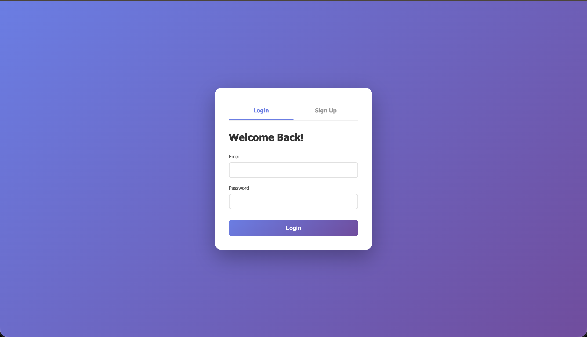

# 🔐 User Authentication System

A modern, secure, and feature-rich user authentication system built with PHP, MySQL, HTML, CSS, and JavaScript.


---

## ✨ Features

### 🔒 Authentication
- **User Registration** - Secure signup with validation
- **User Login** - Session-based authentication
- **Secure Logout** - Clean session termination
- **Password Hashing** - BCrypt password encryption

### 🎨 User Interface
- **Modern Design** - Clean and intuitive interface
- **Responsive Layout** - Works on all devices
- **Smooth Animations** - Professional transitions and effects
- **Real-time Validation** - Instant feedback on form inputs

### 💪 Password Security
- **Strength Indicator** - Visual password strength meter
- **Requirements Checklist** - Clear password requirements
- **Secure Storage** - Passwords hashed with `password_hash()`
- **Validation Rules** - Enforced strong password policies

### 👤 User Dashboard
- **Profile Management** - View and edit user information
- **Password Change** - Update password securely
- **Account Settings** - Manage account preferences
- **Account Deletion** - Option to delete account

### ✅ Form Validation
- **Client-side Validation** - Instant feedback as you type
- **Server-side Validation** - Double-layer security
- **Error Messages** - Clear, specific error feedback
- **Success Indicators** - Visual confirmation of valid inputs

---

## 📁 Project Structure

```
login-practice/
├── index.html              # Main login/signup page
├── style.css               # Main stylesheet
├── script.js               # Client-side JavaScript
├── config.php              # Database configuration
├── login.php               # Login handler
├── signup.php              # Registration handler
├── logout.php              # Logout handler
├── dashboard.php           # User dashboard
├── dashboard-style.css     # Dashboard styles
├── dashboard-script.js     # Dashboard functionality
├── update_profile.php      # Profile update handler
├── change_password.php     # Password change handler
├── delete_account.php      # Account deletion handler
├── test_db.php             # Database connection test
└── README.md               # This file
```

---

## 🚀 Installation

### Prerequisites
- **MAMP** / **XAMPP** / **WAMP** (Local server environment)
- **MySQL** (Database server)
- **PHP 7.4+** (Server-side scripting)
- Modern web browser

### Step 1: Clone or Download
```bash
# Clone the repository
git clone https://github.com/yourusername/login-practice.git

# Or download and extract the ZIP file
```

### Step 2: Set Up Local Server
1. Install **MAMP**, **XAMPP**, or **WAMP**
2. Place the project folder in your server's directory:
   - **MAMP**: `/Applications/MAMP/htdocs/login-practice/`
   - **XAMPP**: `C:\xampp\htdocs\login-practice\`
   - **WAMP**: `C:\wamp64\www\login-practice\`

### Step 3: Configure Database
1. Open **phpMyAdmin**: `http://localhost:8888/phpMyAdmin/` (or port 80 for XAMPP/WAMP)
2. Click the **SQL** tab
3. Run this SQL script:

```sql
CREATE DATABASE IF NOT EXISTS user_auth_system;
USE user_auth_system;

CREATE TABLE IF NOT EXISTS users (
    user_id INT AUTO_INCREMENT PRIMARY KEY,
    username VARCHAR(50) NOT NULL UNIQUE,
    email VARCHAR(100) NOT NULL UNIQUE,
    password_hash VARCHAR(255) NOT NULL,
    created_at TIMESTAMP DEFAULT CURRENT_TIMESTAMP,
    last_login TIMESTAMP NULL,
    is_active BOOLEAN DEFAULT TRUE,
    INDEX idx_email (email)
);

CREATE TABLE IF NOT EXISTS user_sessions (
    session_id INT AUTO_INCREMENT PRIMARY KEY,
    user_id INT NOT NULL,
    session_token VARCHAR(255) NOT NULL UNIQUE,
    created_at TIMESTAMP DEFAULT CURRENT_TIMESTAMP,
    expires_at TIMESTAMP NOT NULL,
    ip_address VARCHAR(45),
    FOREIGN KEY (user_id) REFERENCES users(user_id) ON DELETE CASCADE,
    INDEX idx_session_token (session_token)
);
```

### Step 4: Update Configuration
Open `config.php` and verify/update these settings:

```php
$DB_HOST = 'localhost';
$DB_USER = 'root';
$DB_PASS = 'root';        // Change if needed
$DB_NAME = 'user_auth_system';
$DB_PORT = 3306;          // 3306 for XAMPP/WAMP, 8889 for MAMP
```

### Step 5: Start Your Server
1. Start **Apache** and **MySQL** in your server control panel
2. Verify services are running (green lights)

### Step 6: Access the Application
Open your browser and navigate to:
- **MAMP**: `http://localhost:8888/login-practice/`
- **XAMPP/WAMP**: `http://localhost/login-practice/`

---

## 🎯 Usage

### Creating an Account
1. Click the **"Sign Up"** tab
2. Enter your details:
   - Username (3-20 characters, letters/numbers/underscores)
   - Email address
   - Password (8+ characters, must include uppercase, lowercase, and numbers)
   - Confirm password
3. Watch the real-time validation feedback
4. Click **"Sign Up"**

### Logging In
1. Click the **"Login"** tab
2. Enter your email and password
3. Click **"Login"**
4. You'll be redirected to your dashboard

### Managing Your Profile
1. **View Profile**: See your account information
2. **Edit Profile**: Update username or email
3. **Change Password**: Update your password securely
4. **Account Settings**: Manage preferences or delete account

---

## 🔧 Configuration

### Database Settings
Edit `config.php` to match your environment:

```php
// For MAMP (Mac)
$DB_PORT = 8889;
$DB_PASS = 'root';

// For XAMPP/WAMP (Windows)
$DB_PORT = 3306;
$DB_PASS = '';
```

### Session Settings
Sessions are automatically managed. Default timeout: browser session.

### Password Requirements
Current requirements (can be modified in validation functions):
- Minimum 8 characters
- At least one uppercase letter (A-Z)
- At least one lowercase letter (a-z)
- At least one number (0-9)
- Special characters recommended but not required

---

## 🛡️ Security Features

| Feature | Implementation |
|---------|---------------|
| **Password Hashing** | BCrypt via `password_hash()` |
| **SQL Injection Prevention** | Prepared statements with parameterized queries |
| **XSS Protection** | `htmlspecialchars()` on all user inputs |
| **Session Management** | PHP sessions with secure configuration |
| **CSRF Protection** | Can be added (not yet implemented) |
| **Input Validation** | Client-side + server-side validation |

---

## 📊 Database Schema

### Users Table
```sql
user_id          INT (PK, AUTO_INCREMENT)
username         VARCHAR(50) UNIQUE NOT NULL
email            VARCHAR(100) UNIQUE NOT NULL
password_hash    VARCHAR(255) NOT NULL
created_at       TIMESTAMP DEFAULT CURRENT_TIMESTAMP
last_login       TIMESTAMP NULL
is_active        BOOLEAN DEFAULT TRUE
```

### User Sessions Table (Optional - for future use)
```sql
session_id       INT (PK, AUTO_INCREMENT)
user_id          INT (FK -> users.user_id)
session_token    VARCHAR(255) UNIQUE NOT NULL
created_at       TIMESTAMP DEFAULT CURRENT_TIMESTAMP
expires_at       TIMESTAMP NOT NULL
ip_address       VARCHAR(45)
```

---

## 🎨 Customization

### Changing Colors
Edit `style.css` and `dashboard-style.css`:

```css
/* Main gradient - Login page */
background: linear-gradient(135deg, #667eea 0%, #764ba2 100%);

/* Sidebar gradient - Dashboard */
background: linear-gradient(135deg, #667eea 0%, #764ba2 100%);

/* Button gradient */
background: linear-gradient(135deg, #667eea 0%, #764ba2 100%);
```

### Modifying Validation Rules
Edit validation functions in `script.js` and `dashboard-script.js`:

```javascript
// Change minimum username length
if (username.length < 3) { // Change 3 to your preferred minimum

// Change password requirements
const requirements = {
    length: password.length >= 8,  // Change 8 to your preferred minimum
    uppercase: /[A-Z]/.test(password),
    lowercase: /[a-z]/.test(password),
    number: /[0-9]/.test(password)
};
```

---

## 🐛 Troubleshooting

### Can't Connect to Database
```
Error: Connection failed: Access denied for user 'root'@'localhost'
```
**Solution**: Check your database credentials in `config.php`. Verify MySQL is running.

### 404 Error on Dashboard
```
GET http://localhost:8888/dashboard.php 404 (Not Found)
```
**Solution**: Ensure `dashboard.php` exists in your project folder.

### Password Won't Change
**Solution**: Check that your current password is correct. Verify `change_password.php` is accessible.

### Forms Not Submitting
**Solution**: 
1. Check browser console (F12) for JavaScript errors
2. Verify all PHP files have correct paths
3. Ensure forms have `onsubmit` handlers

### Session Issues
**Solution**: Clear your browser cookies and try again. Verify `config.php` starts the session.

---

## 📈 Future Enhancements

Planned features for future versions:

- [ ] **Remember Me** - Stay logged in with cookies
- [ ] **Password Reset** - Email-based password recovery
- [ ] **Email Verification** - Verify email addresses
- [ ] **Two-Factor Authentication** - Extra security layer
- [ ] **User Roles** - Admin, User, Moderator permissions
- [ ] **Profile Pictures** - Avatar upload and management
- [ ] **Activity Log** - Track login history and IP addresses
- [ ] **Session Timeout** - Auto-logout after inactivity
- [ ] **OAuth Integration** - Login with Google/Facebook
- [ ] **Rate Limiting** - Prevent brute force attacks

---

## 🤝 Contributing

Contributions are welcome! Please follow these steps:

1. Fork the repository
2. Create a feature branch (`git checkout -b feature/AmazingFeature`)
3. Commit your changes (`git commit -m 'Add some AmazingFeature'`)
4. Push to the branch (`git push origin feature/AmazingFeature`)
5. Open a Pull Request

---

## 📝 License

This project is open source and available under the [MIT License](LICENSE).

---

## 👨‍💻 Author

**Your Name**
- GitHub: [@yourusername](https://github.com/yourusername)
- Email: your.email@example.com

---

## 🙏 Acknowledgments

- Inspired by modern authentication systems
- Built with guidance from web development best practices
- Thanks to the PHP and MySQL communities

---

## 📸 Screenshots

### Login Page


### Signup with Validation


### User Dashboard


### Profile Management


---

## 📞 Support

If you encounter any issues or have questions:

1. Check the [Troubleshooting](#-troubleshooting) section
2. Open an issue on GitHub
3. Contact: your.email@example.com

---

**Made with ❤️ and ☕**
